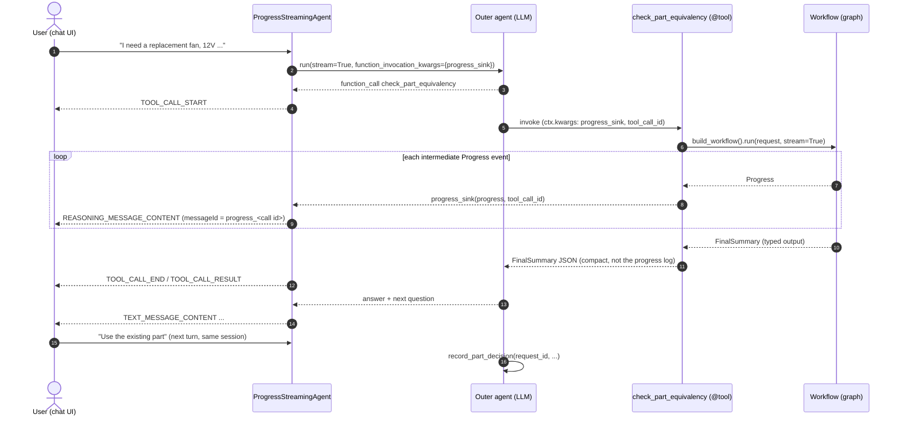

# Agent → deterministic workflow, with live progress (Microsoft Agent Framework, Python)

A runnable sample of one pattern: **one conversational agent decides *whether* to run a deterministic
workflow, and the workflow's intermediate progress streams back inside that agent's own response.** To
the user it is a single agent with a collapsible "sub-task" block (similar to how coding assistants
show tool activity). The conversation then continues normally.

The scenario is an MRO *part equivalency* check:
catalog search → evaluate candidates → web research for ambiguous parts → summary → *"use the existing
part or create a new one?"*

> **This is a sample, not a supported product.** It shows one way to combine public
> [Microsoft Agent Framework](https://github.com/microsoft/agent-framework) APIs. Review and adapt
> it before production use. It runs offline by default with a deterministic stub model.

```text
👤 I need a replacement cooling fan: 12V DC, 120mm, 0.25A, 3-pin connector

 0.36s 🔧 check_part_equivalency (call_b65c8532)          ← the agent decided to run the workflow
 0.39s   ▸ [cortex_search:started] Searching Cortex ...    ← workflow progress, streamed live
 0.57s   ▸ [cortex_search:completed] Found 5 candidate parts
 0.74s   ▸ [evaluate:completed] 1 equivalent, 2 not equivalent, 2 need web research
 0.98s   ▸ [web_research:progress] FAN-12V-120: equivalent - Datasheet rev C lists 0.25A @ 12VDC, 3-pin.
 1.28s   ▸ [web_research:progress] FAN-12V-120-HS: not_equivalent - Datasheet lists 0.45A and a 4-pin PWM connector.
 1.59s 🤖 2 existing part(s) are equivalent ... Do you want to use existing part FAN-12V-120, or create a new part request?

👤 Use the existing part please
 1.86s 🔧 record_part_decision (call_d3fb532b)
 2.02s 🤖 Linked REQ-1F9F48E9 to existing part FAN-12V-120.
```

## Contents

- [The problem](#the-problem)
- [The pattern](#the-pattern)
- [Quick start](#quick-start)
- [Using a real model](#using-a-real-model)
- [How it works](#how-it-works)
- [What the browser receives (AG-UI)](#what-the-browser-receives-ag-ui)
- [Tests](#tests)
- [Adapting it](#adapting-it)
- [Project layout](#project-layout)
- [Tested versions](#tested-versions)
- [References](#references)

## The problem

Requirements:

1. An **outer agent** (LLM) decides *whether* to run the workflow. It can also just chat.
2. **Inside** the workflow, the steps are deterministic. A graph decides what runs next, not an LLM.
   Individual steps may call sub-agents with structured output.
3. The workflow's **intermediate results stream to the user** while it runs, as part of the same agent
   response.
4. Afterwards, the user **continues the same conversation**, e.g. answers the workflow's question.

Requirements 1, 2 and 4 are straightforward: the workflow is just a tool of the outer agent. Requirement 3
is the gap. A tool call is opaque to the agent's response stream:

| Approach | Result |
|---|---|
| `workflow.as_agent().as_tool()` | Runs the workflow to completion and returns **only the final text** to the LLM ([`Agent.as_tool`](https://github.com/microsoft/agent-framework/blob/cb77f68f005f40e0b844392f778c4cb6b91cee1b/python/packages/core/agent_framework/_agents.py#L644-L831)). Nothing reaches the user until the tool returns. |
| `as_tool(stream_callback=...)` | The callback receives the inner updates, but it is a host-side observer. The updates **do not enter the parent agent's stream**, so an AG-UI/SSE client never sees them. |
| Workflow-as-agent in a multi-agent setup | A shared `Workflow` instance cannot run twice concurrently (*"The underlying workflow is in an invalid state to restart: IN_PROGRESS"*, [`_workflows/_agent.py`](https://github.com/microsoft/agent-framework/blob/cb77f68f005f40e0b844392f778c4cb6b91cee1b/python/packages/core/agent_framework/_workflows/_agent.py#L540)). A `request_info` (human-in-the-loop) inside a tool cannot pause the outer agent. |
| Agent/chat middleware | Can observe or transform updates, but cannot *inject* new updates while a tool is running. |

You can see this yourself: `python -m part_equivalency gap` runs both approaches side by side:

```text
=== GAP: workflow.as_agent().as_tool(stream_callback=...)
   0.15s tool call    check_part_equivalency
   1.34s tool result  1396 chars
   1.50s answer starts streaming
  -> stream_callback received 11 updates; 0 reached the agent's response stream

=== FIX: ProgressStreamingAgent + @tool + progress_reporter
   0.16s tool call    check_part_equivalency
   0.17s progress     [cortex_search:started] Searching Cortex for {...}
   ...
   1.05s progress     [web_research:completed] Researched 2 part(s)
   1.20s tool result  499 chars
   1.36s answer starts streaming
```

## The pattern



Three small pieces, all public APIs, nothing patched:

1. **The workflow is an ordinary `@tool`.** The outer LLM decides whether to call it; the graph decides
   the steps. The tool builds a **new workflow instance per call** and returns a compact typed summary.
2. **`ProgressStreamingAgent`** wraps the outer agent. Per streaming run it creates a queue, passes a
   `progress_sink` to tools through `function_invocation_kwargs`, and yields the agent's own updates and
   the tools' progress **in arrival order**. To callers (and AG-UI) it is the same single agent.
3. **`bind_tool_call_id`** function middleware gives the tool its tool-call id, so progress is emitted as
   `text_reasoning` content with `id = "progress_<call id>"`. The AG-UI endpoint turns that into **one
   reasoning block per tool call**, which chat UIs render as a collapsible section.

Human-in-the-loop is simply the **next conversation turn**. The tool returns `next_question`; the agent asks it;
the user's answer leads the agent to call `record_part_decision`. No paused workflow is needed.

More detail, including the workflow graph: [docs/architecture.md](docs/architecture.md).

## Quick start

**Requirements:** Python 3.10–3.13. No credentials are needed for the offline stub model.

```bash
git clone https://github.com/gkoneru/agent-framework-workflow.git
cd agent-framework-workflow
python -m venv .venv
source .venv/bin/activate          # Windows: .venv\Scripts\activate
pip install -e ".[dev]"            # add -c constraints.txt to use the exact tested versions
```

Run it:

```bash
python -m part_equivalency demo    # 3-turn console conversation (chat -> workflow -> decision)
python -m part_equivalency gap     # as_agent().as_tool() vs. this pattern, side by side
python -m part_equivalency serve   # AG-UI endpoint on http://127.0.0.1:8000/chat
pytest                             # offline test suite
```

With the server running, stream a request over Server-Sent Events:

```bash
curl -N http://127.0.0.1:8000/chat \
  -H "Content-Type: application/json" -H "Accept: text/event-stream" \
  -d '{"threadId":"t1","runId":"r1","state":{},"tools":[],"context":[],"forwardedProps":{},
       "messages":[{"id":"m1","role":"user","content":"I need a replacement cooling fan: 12V DC, 120mm, 0.25A, 3-pin connector"}]}'
```

Any AG-UI client (e.g. [CopilotKit](https://docs.copilotkit.ai/)) can connect to the same endpoint.

## Using a real model

Configure **one** provider with environment variables or a `.env` file (see [.env.example](.env.example)).
If none is set, the stub is used. `PART_EQ_PROVIDER` forces a choice.

| Provider | Install | Variables | Auth |
|---|---|---|---|
| OpenAI (Responses API) | `pip install -e .` | `OPENAI_API_KEY`, `OPENAI_MODEL` | API key |
| Azure OpenAI (Responses API) | `pip install -e ".[azure]"` | `AZURE_OPENAI_ENDPOINT`, `AZURE_OPENAI_MODEL` (deployment name) | Entra ID (`az login`) |
| Microsoft Foundry project | `pip install -e ".[foundry]"` | `FOUNDRY_PROJECT_ENDPOINT`, `FOUNDRY_MODEL` (deployment name) | Entra ID (`az login`) |

The four sub-agents (intake, evaluator, web researcher, summarizer) use structured output
(`response_format` = Pydantic model). The researcher gets the provider's hosted web-search tool. Use a model
deployment that supports tool calling, structured outputs and hosted web search.
`RESEARCH_BACKGROUND=1` runs research calls in OpenAI Responses background mode (polling a continuation token).

For Azure, `AZURE_OPENAI_ENDPOINT` can be `https://<resource>.openai.azure.com/` or
`https://<resource>.cognitiveservices.azure.com/`. The signed-in identity needs the
*Cognitive Services OpenAI User* role on the resource.

To run the same conversation against your model as a test: `pytest -m live`.
This sample was validated against Azure OpenAI `gpt-5.4-mini`, with and without `RESEARCH_BACKGROUND=1`.

## How it works

The tool, the outer agent, and the agent you expose ([`agent.py`](src/part_equivalency/agent.py), abridged):

```python
@tool(name="check_part_equivalency", approval_mode="never_require")
async def check_part_equivalency(
    description: Annotated[str, Field(description="Free-text description of the requested part")],
    specs: Annotated[dict[str, str], Field(description="Normalized attributes, e.g. {'voltage': '12VDC'}")],
    ctx: FunctionInvocationContext,  # injected by the framework, hidden from the LLM's tool schema
) -> str:
    report = progress_reporter(ctx)
    request = PartRequest(description=description, specs={k.lower(): v for k, v in specs.items()})
    summary = None
    async for event in build_workflow().run(request, stream=True):  # fresh instance per call
        if event.type == "intermediate" and isinstance(event.data, Progress):
            await report(event.data)  # -> streamed to the user
        elif event.type == "output" and isinstance(event.data, FinalSummary):
            summary = event.data
        elif event.type == "failed":
            raise WorkflowFailedError(...)
    return summary.model_dump_json()  # -> returned to the LLM


def create_master_agent(*, client=None) -> Agent:
    return Agent(
        name="parts_assistant",
        instructions=MASTER_INSTRUCTIONS,
        client=client or make_chat_client(),
        tools=[check_part_equivalency, record_part_decision],
        middleware=[bind_tool_call_id],
    )


def create_agent(*, client=None) -> ProgressStreamingAgent:
    return ProgressStreamingAgent(create_master_agent(client=client))
```

The reusable part ([`streaming.py`](src/part_equivalency/streaming.py), about 100 lines, not specific to this
scenario; abridged):

```python
@function_middleware
async def bind_tool_call_id(ctx: FunctionInvocationContext, call_next) -> None:
    ctx.kwargs["tool_call_id"] = ctx.metadata.get("call_id")
    await call_next()


class ProgressStreamingAgent(BaseAgent):
    def run(self, messages=None, *, stream=False, session=None, **kwargs):
        if not stream:
            return self.inner.run(messages, session=session, **kwargs)
        return ResponseStream(self._stream(messages, session=session, **kwargs), finalizer=AgentResponse.from_updates)

    async def _stream(self, messages, *, session, **kwargs):
        queue = asyncio.Queue()
        # sink() puts AgentResponseUpdate(contents=[Content.from_text_reasoning(id=f"progress_{call_id}", ...)])
        function_kwargs = {**(kwargs.pop("function_invocation_kwargs", None) or {}), "progress_sink": sink}
        # pump(): async for update in self.inner.run(..., stream=True, function_invocation_kwargs=function_kwargs)
        #             -> queue; exceptions forwarded; cancelled if the consumer goes away
        # yield from the queue until done
```

The workflow ([`workflow.py`](src/part_equivalency/workflow.py)) is a `WorkflowBuilder` graph. Executors
stream `Progress` with `ctx.yield_output(...)`, which surfaces as `intermediate` events
(`intermediate_output_from="all_other"`). Routing after evaluation is a deterministic switch-case edge on the
message type. Web research runs each ambiguous candidate concurrently (bounded by a semaphore) and streams each
result as it completes. Sub-agents only produce structured data; **code** computes the final verdicts.

## What the browser receives (AG-UI)

The [AG-UI endpoint](https://learn.microsoft.com/agent-framework/integrations/ag-ui/)
(`add_agent_framework_fastapi_endpoint`) maps the stream to [AG-UI events](https://docs.ag-ui.com/concepts/events):

```text
RUN_STARTED
TEXT_MESSAGE_START / TEXT_MESSAGE_END                                             (parent message of the tool call)
TOOL_CALL_START            toolCallName=check_part_equivalency  toolCallId=call_123
TOOL_CALL_ARGS
REASONING_START            messageId=progress_call_123
REASONING_MESSAGE_START    messageId=progress_call_123
REASONING_MESSAGE_CONTENT  "[cortex_search:started] Searching Cortex ..."     ┐ streamed live
REASONING_MESSAGE_CONTENT  "[cortex_search:completed] Found 5 candidate parts" │ while the tool
...                                                                            │ is running
REASONING_MESSAGE_CONTENT  "[web_research:completed] Researched 2 part(s)"     ┘
REASONING_MESSAGE_END / REASONING_END
TOOL_CALL_END / TOOL_CALL_RESULT
TEXT_MESSAGE_START / TEXT_MESSAGE_CONTENT ... / TEXT_MESSAGE_END                  the agent's answer
MESSAGES_SNAPSHOT
RUN_FINISHED
```

Render the reasoning block as a collapsible "sub-task" under the tool call. Each progress item's structured
payload (`Progress.model_dump()`) also travels in the content's `additional_properties["progress"]` for
in-process consumers. The AG-UI text delta is the human-readable line.

## Tests

```bash
pytest                    # offline, deterministic stub model (~7 s)
pytest -m live            # same flow against a real model (needs a provider configured)
ruff check . && ruff format --check .
```

| File | Covers |
|---|---|
| `test_workflow.py` | Classification and recommendation, stage order, research results streamed as they complete, no-research path, research failure → *inconclusive* (not fatal), `_reconcile` guard, concurrent runs on one instance fail (fresh instances succeed), `request_info` decision gate when hosted directly |
| `test_streaming.py` | Progress arrives **between** tool call and tool result with one id per call; `get_final_response()`; non-streaming passthrough; reporter is a no-op without the wrapper; errors propagate; a cancelled consumer cancels the running tool; caller `function_invocation_kwargs` are preserved |
| `test_conversation.py` | Three turns on one session: chat → workflow → `record_part_decision` with the `request_id` from the history |
| `test_server.py` | AG-UI over SSE: one `REASONING` block inside `TOOL_CALL_START…TOOL_CALL_END`, `messageId = progress_<toolCallId>`; plain chat has none |
| `test_gap.py` | Documents the `as_tool()` behaviour (fails intentionally if a future release streams into the parent) |
| `test_models.py` | LLM-facing schemas are strict-structured-output compatible |
| `test_cli.py` | `demo` / `gap` commands; invalid provider rejected |
| `test_live.py` | Optional real-model conversation (`-m live`) |

CI ([.github/workflows/ci.yml](.github/workflows/ci.yml)) runs lint and the offline tests on Python 3.10–3.13,
with the pinned [constraints.txt](constraints.txt) and with the latest releases.

## Adapting it

- **Your catalog search.** Replace `search_cortex` in [`cortex.py`](src/part_equivalency/cortex.py)
  (e.g. Snowflake Cortex Search). Keep the signature `async (PartRequest, top_k) -> list[Candidate]`.
- **Your workflow.** Any workflow works. Have executors `ctx.yield_output(<progress>)` and build with
  `intermediate_output_from=...`. Report those events from your tool with `progress_reporter(ctx)`.
  `streaming.py` has no scenario-specific code.
- **One workflow instance per call.** `Workflow` instances run one at a time. Build one per tool call (cheap).
  Do not share one across users or sessions.
- **Writes need approval.** `record_part_decision` writes to the system of record. In production, use
  `approval_mode="always_require"` so the user approves it (AG-UI surfaces the approval request).
- **Human-in-the-loop.** Inside a tool, ask follow-up questions through the outer agent (next turn), as shown.
  The `UserDecision` executor (`build_workflow(with_decision_gate=True)`) shows the `request_info` alternative
  for when you host the workflow *directly* (not as a tool).
- **Long-running steps.** `RESEARCH_BACKGROUND=1` uses Responses background mode for one step. For workflows that
  outlive a request, use workflow checkpointing (`build_workflow(checkpoint_storage=...)`) and a durable host.
- **Parallel tool calls.** If the model calls several workflow tools at once, their progress interleaves. Each
  call still has its own `messageId`, so group by it in the UI.
- **Cancellation.** When the client disconnects, the server cancels the run. The wrapper cancels the inner run
  and therefore the workflow (covered by a test).

## Project layout

```text
src/part_equivalency/
  streaming.py   reusable: ProgressStreamingAgent, bind_tool_call_id, progress_reporter
  agent.py       outer agent + tools (check_part_equivalency, record_part_decision)
  workflow.py    deterministic graph: intake → cortex search → evaluate → [web research] → summarize
  models.py      typed messages (Pydantic); LLM-facing ones are strict-schema compatible
  llm.py         provider selection (OpenAI / Azure OpenAI / Foundry / stub) + structured-output helper
  cortex.py      stub catalog search - replace with your search
  stub.py        deterministic offline model used by default and in tests
  server.py      AG-UI FastAPI endpoint (POST /chat, GET /healthz)
  gap.py         side-by-side comparison with workflow.as_agent().as_tool()
  __main__.py    CLI: demo | gap | serve
tests/           pytest suite (offline by default)
docs/            architecture notes
```

## Tested versions

| Package | Version |
|---|---|
| agent-framework-core | 1.19.0 |
| agent-framework-openai | 1.14.4 |
| agent-framework-ag-ui | 1.4.0 |
| agent-framework-foundry | 1.13.1 |
| Python | 3.10, 3.11, 3.12, 3.13 |

`pyproject.toml` allows any `1.x` release from those versions on. The relevant framework code (`Agent.as_tool`,
the function-middleware `call_id`, the AG-UI reasoning mapping) is unchanged in **1.20.0**, and CI also tests
the latest releases.

## References

- Agent Framework: [repository](https://github.com/microsoft/agent-framework) ·
  [Workflows](https://learn.microsoft.com/agent-framework/workflows/) ·
  [Middleware](https://learn.microsoft.com/agent-framework/agents/middleware/) ·
  [AG-UI integration](https://learn.microsoft.com/agent-framework/integrations/ag-ui/)
- Source, tag `python-1.20.0`:
  [`Agent.as_tool`](https://github.com/microsoft/agent-framework/blob/cb77f68f005f40e0b844392f778c4cb6b91cee1b/python/packages/core/agent_framework/_agents.py#L644-L831) (returns `final_response.text`; `stream_callback` is a host-side observer) ·
  [function middleware `call_id`](https://github.com/microsoft/agent-framework/blob/cb77f68f005f40e0b844392f778c4cb6b91cee1b/python/packages/core/agent_framework/_tools.py#L2179) ·
  [workflow-as-agent restart check](https://github.com/microsoft/agent-framework/blob/cb77f68f005f40e0b844392f778c4cb6b91cee1b/python/packages/core/agent_framework/_workflows/_agent.py#L540) ·
  [AG-UI `text_reasoning` → reasoning events](https://github.com/microsoft/agent-framework/blob/cb77f68f005f40e0b844392f778c4cb6b91cee1b/python/packages/ag-ui/agent_framework_ag_ui/_run_common.py#L1150)
- Related samples: [`workflow_as_agent_human_in_the_loop.py`](https://github.com/microsoft/agent-framework/blob/cb77f68f005f40e0b844392f778c4cb6b91cee1b/python/samples/03-workflows/agents/workflow_as_agent_human_in_the_loop.py) ·
  [`agent_as_tool_vs_workflow_approval.py`](https://github.com/microsoft/agent-framework/blob/cb77f68f005f40e0b844392f778c4cb6b91cee1b/python/samples/03-workflows/tool-approval/agent_as_tool_vs_workflow_approval.py) ·
  [`ag_ui_single_agent`](https://github.com/microsoft/agent-framework/tree/cb77f68f005f40e0b844392f778c4cb6b91cee1b/python/samples/05-end-to-end/ag_ui_single_agent)
- [AG-UI protocol events](https://docs.ag-ui.com/concepts/events)

## License

[MIT](LICENSE)
