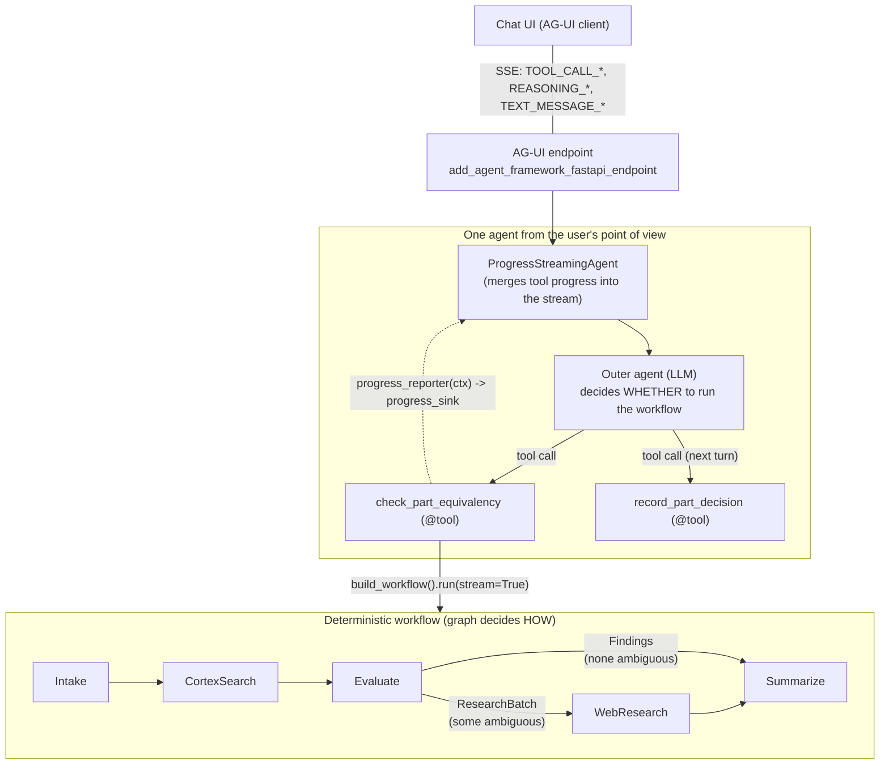

# Architecture

## Layers



| Responsibility | Where | Decided by |
|---|---|---|
| Chat, or run the workflow? Which arguments? | Outer agent | LLM |
| Which step runs next, and what to research | Workflow edges and executor code | Code |
| Classify candidates, research one part, write prose | Sub-agents with `response_format` | LLM, but structured and validated |
| Final verdicts, recommendation | `Summarize` executor | Code |
| Use existing part or create new? | Next user turn → `record_part_decision` | User |

## Workflow steps

| Executor | LLM? | Streams (`Progress`) | Sends |
|---|---|---|---|
| `Intake` | Only for free text (structured `IntakeSpec`) | no | `PartRequest` |
| `CortexSearch` | no | started, completed (+ candidates) | `CandidateSet` |
| `Evaluate` | yes (`EvaluationResult`); `_reconcile` guarantees one verdict per candidate | started, completed (+ classifications) | `ResearchBatch` or `Findings` (switch-case edge) |
| `WebResearch` | yes, one call per ambiguous part, hosted web search, bounded concurrency, `as_completed` | started per part, progress per result, completed | `Findings` |
| `Summarize` | yes, prose only (`FinalSummaryDraft`) | - | yields `FinalSummary` (output) |
| `UserDecision` (optional) | no | - | `request_info` → `DecisionOutcome`; only when hosting the workflow directly |

Executors emit `Progress` with `ctx.yield_output(...)`. Because the builder sets
`output_from=[summarize]` and `intermediate_output_from="all_other"`, those arrive as `intermediate` events,
and only `Summarize` produces `output` events.

A research call that fails becomes an *inconclusive* result for that part. It does not fail the run.

## Why a wrapper agent

`Agent.run(stream=True)` yields what the chat client produces plus the function-call and function-result
contents. A running tool has no way to add updates to that stream. `ProgressStreamingAgent` adds a side
channel:

```text
ProgressStreamingAgent._stream()
 ├─ creates asyncio.Queue
 ├─ pump task: async for u in inner.run(stream=True, function_invocation_kwargs={..., progress_sink}) -> queue
 │               tool: progress_reporter(ctx)(item) -> progress_sink -> queue (text_reasoning update)
 └─ yields queue items until the pump finishes; re-raises its exception; cancels it if the consumer stops
```

- `function_invocation_kwargs` reach the tool as `ctx.kwargs`. They are **not** part of the LLM's tool schema.
  The wrapper merges its sink into any kwargs the caller already passes (e.g. the AG-UI endpoint).
- `bind_tool_call_id` copies `ctx.metadata["call_id"]` (set by the framework when a function-middleware
  pipeline exists) into `ctx.kwargs["tool_call_id"]`.
- Progress uses `Content.from_text_reasoning(id="progress_<call id>")`. The AG-UI mapping groups consecutive
  reasoning content with the same id into one `REASONING_START … REASONING_END` block, and emits it between
  `TOOL_CALL_START` and `TOOL_CALL_END` because the tool has not returned yet.
- Non-streaming runs pass straight through to the inner agent.

## Why not …

| Option | Why not, for these requirements |
|---|---|
| `workflow.as_agent().as_tool()` | Returns only the final text; `stream_callback` is host-side, not part of the parent stream. |
| Workflow-as-agent behind a router or handoff | The *workflow* becomes the conversational surface, and the outer agent no longer decides. Sharing one instance across concurrent requests fails. |
| Hosting the workflow directly as the AG-UI endpoint | Streams well, but there is no outer agent to decide whether to run it. Good for a "run this process" button, not for chat. |
| Agent-orchestrated steps (LLM calls search, evaluate, research tools itself) | Not deterministic; that is exactly what the requirement rules out. |
